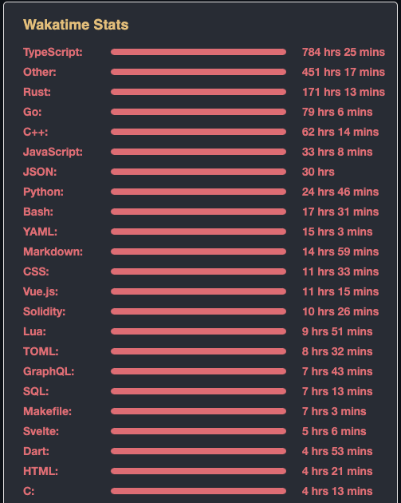

---
# try also 'default' to start simple
theme: seriph
# random image from a curated Unsplash collection by Anthony
# like them? see https://unsplash.com/collections/94734566/slidev
background: black
# apply any windi css classes to the current slide
class: "text-center"
# https://sli.dev/custom/highlighters.html
highlighter: shiki
# show line numbers in code blocks
lineNumbers: false
# some information about the slides, markdown enabled
info: |
  ## Slidev Starter Template
  Presentation slides for developers.

  Learn more at [Sli.dev](https://sli.dev)
# persist drawings in exports and build
drawings:
  persist: false
# page transition
transition: fade
fonts:
  sans: Robot
  serif: Robot Slab
  mono: Fira Code
---

# Journey to Rust from a student

Rust is such an amazing language!

<div class="abs-tr !mx-6 !my-8 flex flex-col animate-pulse">
  
</div>

<div class="abs-bl !mx-14 my-12 flex flex-col">
  <div class="mb-3 uppercase tracking-widest font-medium">
  Marcus Lee
  </div>
  <div class="text-md opacity-50">Infrastruture Engineer @ Balaena Quant</div>
</div>

<style>
  div {
    @apply text-left font-sans;
  }
</style>

---

# Marcus Lee

<div class="opacity-80">
  <div class="inline flex items-center">- Recent software engineering graduate from <a class="flex items-center ml-1 opacity-70" href="https://www.tarc.edu.my/" target="_blank">TARUC</a></div><br>
  <div class="inline flex items-center">- Previously worked at e-commerce solutions, Web 3 platforms</div><br>
  <div class="flex">- Love and contribute to open-source</div><br>
</div>

<div class="my-10 grid grid-cols-[40px,1fr] w-max gap-y-4">
  <ri-github-line class="opacity-50"/>
  <div><a href="https://github.com/marcustut" target="_blank">marcustut</a></div>
  <ri-instagram-line class="opacity-50"/>
  <div><a href="https://instagram.com/geminimarcus" target="_blank">geminimarcus</a></div>
  <ri:linkedin-box-line class="opacity-50"/>
  <div><a href="https://www.linkedin.com/in/geminimarcus/" target="_blank">Marcus Lee</a></div>
</div>


<style>
  a {
    @apply hover:text-neutral-200 hover:opacity-100
  }
</style>

<!--
-->

---

# Programming Languages

Below are a list of languages ranked from my favourite to least.

<div v-click class="mb-2">1. Rust</div>
<div v-click class="mb-2">2. C/C++</div>
<div v-click class="mb-2">3. TypeScript (functional)</div>
<div v-click class="mb-2">4. Go</div>
<div v-click class="mb-2">5. Python</div>

---

# Actually...

The facts are:

<div class="flex items-center">
  
  
</div>

---

<div class="flex items-center">
  
  <div v-click class="ml-12">Developers rarely get to use their favourite language.</div>
</div>

---

<div class="flex justify-center items-center h-full text-3xl text-neutral-300">What about your favourite lang?</div>

---

# Why Rust?

- Annoying
-
- Super strict like Asian Parents

<!--
-->

---

## class: px-20

# Themes

Slidev comes with powerful theming support. Themes can provide styles, layouts, components, or even configurations for tools. Switching between themes by just **one edit** in your frontmatter:

<div grid="~ cols-2 gap-2" m="-t-2">

```yaml
---
theme: default
---
```

```yaml
---
theme: seriph
---
```


</div>

Read more about [How to use a theme](https://sli.dev/themes/use.html) and
check out the [Awesome Themes Gallery](https://sli.dev/themes/gallery.html).

---

## preload: false

# Animations

Animations are powered by [@vueuse/motion](https://motion.vueuse.org/).

```html
<div v-motion :initial="{ x: -80 }" :enter="{ x: 0 }">Slidev</div>
```

<div class="w-60 relative mt-6">
  <div class="relative w-40 h-40">
    
    
    
  </div>

  <div
    class="text-5xl absolute top-14 left-40 text-[#2B90B6] -z-1"
    v-motion
    :initial="{ x: -80, opacity: 0}"
    :enter="{ x: 0, opacity: 1, transition: { delay: 2000, duration: 1000 } }">
    Slidev
  </div>
</div>

<!-- vue script setup scripts can be directly used in markdown, and will only affects current page -->
<script setup lang="ts">
const final = {
  x: 0,
  y: 0,
  rotate: 0,
  scale: 1,
  transition: {
    type: 'spring',
    damping: 10,
    stiffness: 20,
    mass: 2
  }
}
</script>

<div
  v-motion
  :initial="{ x:35, y: 40, opacity: 0}"
  :enter="{ y: 0, opacity: 1, transition: { delay: 3500 } }">

[Learn More](https://sli.dev/guide/animations.html#motion)

</div>

---

# LaTeX

LaTeX is supported out-of-box powered by [KaTeX](https://katex.org/).

<br>

Inline $\sqrt{3x-1}+(1+x)^2$

Block

$$
\begin{array}{c}

\nabla \times \vec{\mathbf{B}} -\, \frac1c\, \frac{\partial\vec{\mathbf{E}}}{\partial t} &
= \frac{4\pi}{c}\vec{\mathbf{j}}    \nabla \cdot \vec{\mathbf{E}} & = 4 \pi \rho \\

\nabla \times \vec{\mathbf{E}}\, +\, \frac1c\, \frac{\partial\vec{\mathbf{B}}}{\partial t} & = \vec{\mathbf{0}} \\

\nabla \cdot \vec{\mathbf{B}} & = 0

\end{array}
$$

<br>

[Learn more](https://sli.dev/guide/syntax#latex)

---

# Diagrams

You can create diagrams / graphs from textual descriptions, directly in your Markdown.

<div class="grid grid-cols-3 gap-10 pt-4 -mb-6">


</div>

[Learn More](https://sli.dev/guide/syntax.html#diagrams)

---

src: ./pages/multiple-entries.md
hide: false

---

---

layout: center
class: text-center

---

# Learn More

[Documentations](https://sli.dev) · [GitHub](https://github.com/slidevjs/slidev) · [Showcases](https://sli.dev/showcases.html)
